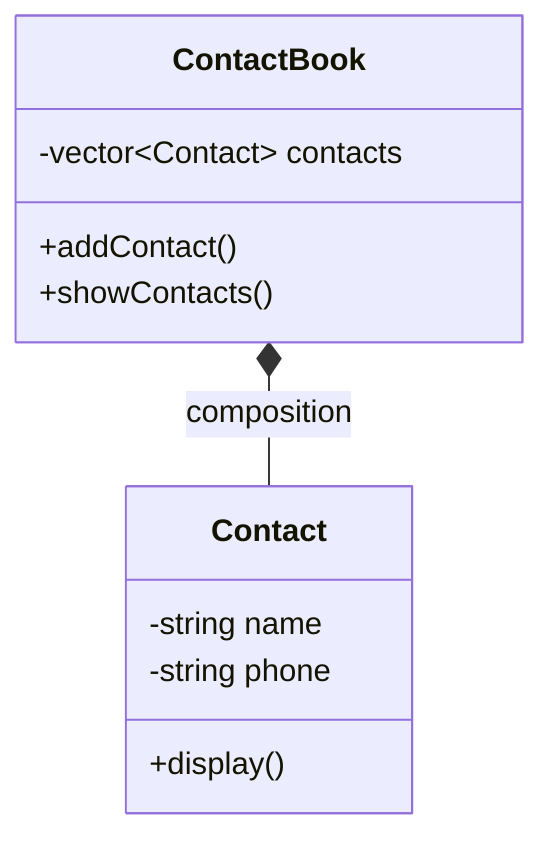

# Composition in C++

## 📌 Definition

**Composition** is the strongest form of class relationship in object-oriented design.  
It expresses a **whole‑part** dependency where:

- The **whole** (parent) **owns** the **part** (child).
- The part **cannot exist** without the whole.
- If the whole is destroyed, **all its parts are automatically destroyed** too.

> *“Composition implies exclusive ownership and lifetime control.”*

## 📘 Real‑World Analogy

> **Digital Contact Book**  
> The `ContactBook` is the **whole**. Each `Contact` is a **part**.  
> If you delete the contact book, every contact inside it is gone – they cannot float around independently.

---

## 💻 C++ Implementation (Corrected & Modern)

The following code follows **modern C++ practices** and correctly models composition:

```cpp
#include <iostream>
#include <string>
#include <vector>

// Part class – represents a single contact entry
class Contact {
public:
    Contact(const std::string& n, const std::string& p)
        : name(n), phone(p) {}

    void display() const {
        std::cout << name << " - " << phone << "\n";
    }

private:
    std::string name;
    std::string phone;
};

// Whole class – owns the parts via direct containment (by value)
class ContactBook {
public:
    void addContact(const std::string& name, const std::string& phone) {
        contacts.emplace_back(name, phone);   // constructs Contact inside vector
    }

    void showContacts() const {
        for (const auto& contact : contacts) {
            contact.display();
        }
    }

private:
    std::vector<Contact> contacts;   // 🔒 exclusive ownership
};

int main() {
    ContactBook myBook;               // whole created
    myBook.addContact("Alice", "123-456");
    myBook.addContact("Bob", "987-654");
    myBook.showContacts();

    // When myBook goes out of scope, its destructor destroys
    // the vector, which in turn destroys every Contact.
    // → No memory leak, no dangling parts.
}
```

**Output**:
```
Alice - 123-456
Bob - 987-654
```

---

## ⚙️ How Composition Works in C++

| C++ Mechanism                | Effect                                                                 |
|------------------------------|------------------------------------------------------------------------|
| **Containment by value**     | The part lives **inside** the whole (same memory footprint).           |
| **`std::vector<Contact>`**   | The whole manages a collection of parts as direct members.             |
| **Destructor chaining**      | When `ContactBook` is destroyed, `~vector()` destroys all `Contact`s.  |
| **No external references**   | Parts cannot outlive the whole (unless you deliberately leak pointers, which you should not). |

---

## 🧠 Key Points to Remember

1. **Strongest coupling** – Changes to the whole often affect parts.
2. **Lifetime dependency** – Parts die with the whole.
3. **Exclusive ownership** – A part belongs to exactly one whole.
4. **In C++** – Prefer:
   - **Member objects** (by value) for fixed parts
   - **`std::vector` / `std::array`** for multiple owned parts
   - **`std::unique_ptr`** when you need polymorphism or forward declaration
5. **UML rule** – Filled diamond **on the whole side**.

---

## 🆚 Composition vs Aggregation (Quick Comparison)

| Feature               | Composition (whole–part)          | Aggregation (shared part)      |
|-----------------------|------------------------------------|--------------------------------|
| **Lifetime**          | Part dies with whole               | Part can outlive whole         |
| **Ownership**         | Exclusive (one whole)              | Shared (many wholes possible)  |
| **UML diamond**       | **Filled** black                   | **Empty** white                |
| **C++ typical impl.** | Member by value, `vector`, `unique_ptr` | Raw pointer, `shared_ptr`, reference |
| **Example**           | `Contact` inside `ContactBook`     | `Department` with `Employee` (employee exists even if department closes) |

---




---

## ⚠️ Common Pitfalls & Best Practices

| ❌ Pitfall                                    | ✅ Best Practice                                                           |
| -------------------------------------------- | ------------------------------------------------------------------------- |
| Storing parts via raw pointers               | Use `std::vector<Contact>` or `std::unique_ptr`                           |
| Giving out non‑const references to parts     | Breaks encapsulation; can lead to dangling references                     |
| Forgetting that copy copies parts            | If copying is not desired, delete copy constructor / make class move‑only |
| Using composition when aggregation is needed | Ask: “Should the part exist without the whole?”                           |

---

## 🧪 Proven Check – Is the Example *Real* Composition?

- **Destruction test** – When `myBook` goes out of scope, all `Contact` objects are destroyed automatically (no manual `delete`). ✅
- **Ownership test** – No other object holds or can access those `Contact` instances. ✅
- **Lifetime test** – You cannot create a `Contact` without a `ContactBook` in this design. ✅

> ✅ The example satisfies **all three criteria** for composition.

---

## 📚 References (Double‑Checked)

- **UML 2.5.1 Specification** – Section 11.5.3.2 “Composite Aggregation”
- **Gamma et al. (GoF)** – *“Prefer composition over inheritance”*
- **C++ Core Guidelines** – [C.20](https://isocpp.github.io/CppCoreGuidelines/CppCoreGuidelines#c20-use-constructors-to-set-up-invariants), [C.21](https://isocpp.github.io/CppCoreGuidelines/CppCoreGuidelines#c21-use-move-operations-to-transfer-ownership)
- **ISO C++ Standard** – Destructor ordering, container lifetimes (§[class.dtor], §[vector] )

---